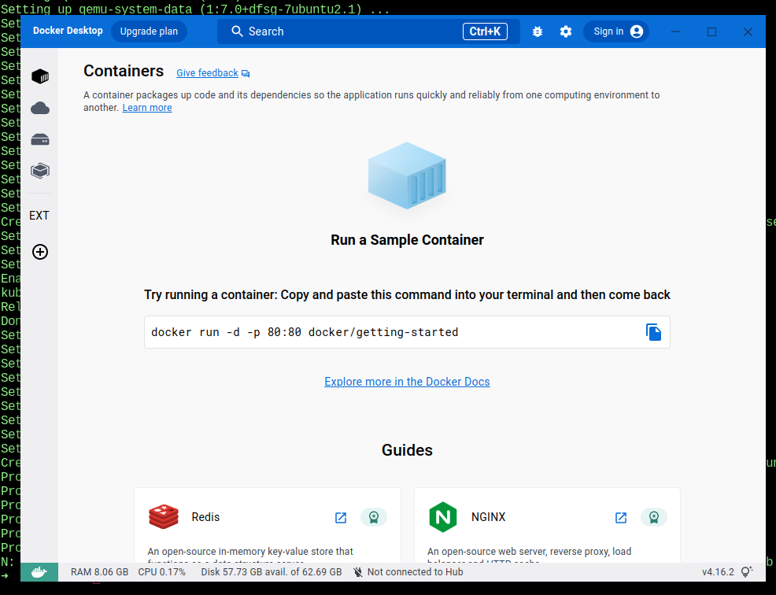

# Aztec Local Docker Devnet - Linux Developer Experience

###### tags: `Aztec Developer Relations` `Onboarding` `Local Devnet` `Docker` `Linux` `Setup` `Developer Experience` `DevEx` `DX`

### [Docs for setting up a local Aztec docker development environment](https://docs.aztec.network/developers/local-devnet)

- https://docs.aztec.network/developers/local-devnet

### Check your Linux system

This step is important in order to reproduce issues across different systems.

```shell=
$ sudo apt install lsb-core
$ lsb_release -a

LSB Version:    core-11.2ubuntu1-noarch:security-11.2ubuntu1-noarch
Distributor ID: Ubuntu
Description:    Ubuntu 22.10
Release:        22.10
Codename:       kinetic
```

### The Docker Compose script source

- https://raw.githubusercontent.com/AztecProtocol/dev-rel/main/docker-compose.dev.yml

```dockerfile=
version: '3'
services:
  contracts:
    platform: linux/amd64
    image: aztecprotocol/contracts:latest
    environment:
      ETHEREUM_HOST: ${ETHEREUM_HOST:-}
      PORT: 8547
    command: ./scripts/start_e2e.sh
    ports:
      - '8545:8544'

  falafel:
    platform: linux/amd64
    image: aztecprotocol/falafel:latest
    environment:
      ETHEREUM_HOST: ${ETHEREUM_HOST:-http://contracts:8544}
      CONTRACTS_HOST: http://contracts:8547
      NUM_INNER_ROLLUP_TXS: ${NUM_INNER_ROLLUP_TXS:-3}
      NUM_OUTER_ROLLUP_PROOFS: ${NUM_OUTER_ROLLUP_PROOFS:-1}
      PROVERLESS: 'true'
      MAX_CIRCUIT_SIZE: 8192
      PROOF_GENERATOR_MODE: local
      NO_BUILD: 'true'
      PORT: 8081
    depends_on:
      - contracts
    command: start:e2e
    ports:
      - '8081:8081'
```
- https://raw.githubusercontent.com/AztecProtocol/dev-rel/main/docker-compose.fork.yml

```dockerfile=
version: "3"
services:
  fork:
    image: ghcr.io/foundry-rs/foundry:nightly-8c4294c1d2321e20a3543fbd9a813d47053a8303
    entrypoint: "anvil -p=8545 --host 0.0.0.0 --fork-url ${FORK_URL} --chain-id ${CHAIN_ID} --silent"
    ports:
      - "8545:8545"

  contracts:
    platform: linux/amd64
    image: aztecprotocol/contracts:latest
    environment:
      ETHEREUM_HOST: http://fork:8545
      PORT: 8547
    command: ./scripts/start_e2e.sh
    depends_on:
      - fork

  falafel:
    platform: linux/amd64
    image: aztecprotocol/falafel:latest
    environment:
      ETHEREUM_HOST: http://fork:8545
      CONTRACTS_HOST: http://contracts:8547
      NUM_INNER_ROLLUP_TXS: ${NUM_INNER_ROLLUP_TXS:-3}
      NUM_OUTER_ROLLUP_PROOFS: ${NUM_OUTER_ROLLUP_PROOFS:-1}
      PROVERLESS: "true"
      MAX_CIRCUIT_SIZE: 8192
      PROOF_GENERATOR_MODE: local
      NO_BUILD: "true"
      PORT: 8081
      INITIAL_RUNTIME_CONFIG_PATH: "./config/dev_testnet_initial_config.json"
    depends_on:
      - contracts
    command: start:e2e
    ports:
      - "8081:8081"
```

## Install Docker

- https://docs.docker.com/desktop/install/linux-install/
- https://docs.docker.com/desktop/install/ubuntu/
- https://docs.docker.com/desktop/install/linux-install/#system-requirements

### Important notes

Docker Desktop on Linux runs a Virtual Machine (VM) so creates and uses a custom docker context desktop-linux on startup.

This means images and containers deployed on the Linux Docker Engine (before installation) are not available in Docker Desktop for Linux.

For more information see [What is the difference between Docker Desktop for Linux and Docker Engine](https://docs.docker.com/desktop/faqs/linuxfaqs/#what-is-the-difference-between-docker-desktop-for-linux-and-docker-engine).
- https://docs.docker.com/desktop/faqs/linuxfaqs/#what-is-the-difference-between-docker-desktop-for-linux-and-docker-engine

Docker does not provide support for running Docker Desktop in nested virtualization scenarios. We recommend that you run Docker Desktop for Linux natively on supported distributions.

### Supported platforms

Docker provides .deb and .rpm packages from the following Linux distributions and architectures:

Platform	x86_64 / amd64

Ubuntu	yes
https://docs.docker.com/desktop/install/ubuntu/

Debian	yes
https://docs.docker.com/desktop/install/debian/

Fedora	yes
https://docs.docker.com/desktop/install/fedora/

### Terminal steps (Option 1)

- Update the apt package index:

```shell
$ sudo apt-get update
```
- Install packages to allow apt to use a repository over HTTPS:

```shell
$ sudo apt-get install \
    ca-certificates \
    curl \
    gnupg \
    lsb-release
```

- Add Docker’s official GPG key:

```shell
$ sudo mkdir -m 0755 -p /etc/apt/keyrings
$ curl -fsSL https://download.docker.com/linux/ubuntu/gpg | sudo gpg --dearmor -o /etc/apt/keyrings/docker.gpg
```

- Use the following command to set up the repository:

```shell
$ echo \
  "deb [arch=$(dpkg --print-architecture) signed-by=/etc/apt/keyrings/docker.gpg] https://download.docker.com/linux/ubuntu \
  $(lsb_release -cs) stable" | sudo tee /etc/apt/sources.list.d/docker.list > /dev/null
```

- Receiving a GPG error when running apt-get update?
	- Your default umask may be incorrectly configured, preventing detection of the repository public key file. 
	- Try granting read permission for the Docker public key file before updating the package index:

```shell
$ sudo chmod a+r /etc/apt/keyrings/docker.gpg
$ sudo apt-get update
```

- Verify that the Docker Engine installation is successful by running the hello-world image:

```shell
$ sudo docker run hello-world

Unable to find image 'hello-world:latest' locally
latest: Pulling from library/hello-world
2db29710123e: Pull complete 
Digest: sha256:6e8b6f026e0b9c419ea0fd02d3905dd0952ad1feea67543f525c73a0a790fefb
Status: Downloaded newer image for hello-world:latest

Hello from Docker!
This message shows that your installation appears to be working correctly.

To generate this message, Docker took the following steps:
 1. The Docker client contacted the Docker daemon.
 2. The Docker daemon pulled the "hello-world" image from the Docker Hub.
    (amd64)
 3. The Docker daemon created a new container from that image which runs the
    executable that produces the output you are currently reading.
 4. The Docker daemon streamed that output to the Docker client, which sent it
    to your terminal.

To try something more ambitious, you can run an Ubuntu container with:
 $ docker run -it ubuntu bash

Share images, automate workflows, and more with a free Docker ID:
 https://hub.docker.com/

For more examples and ideas, visit:
 https://docs.docker.com/get-started/
```

- Download and install the latest Docker Desktop DEB package.

```shell
$ cd ~/Downloads
# $ sudo apt-get install ./docker-desktop-<version>-<arch>.deb
$ sudo apt-get install ./docker-desktop-4.16.2-amd64.deb
```

#### Potential errors

```shell
Some packages could not be installed. This may mean that you have
requested an impossible situation or if you are using the unstable
distribution that some required packages have not yet been created
or been moved out of Incoming.
The following information may help to resolve the situation:

The following packages have unmet dependencies.
 docker-desktop : Depends: docker-ce-cli but it is not installable
E: Unable to correct problems, you have held broken packages.
```

- Do the following to add the APT repository and remedy this:

```shell
$ sudo add-apt-repository "deb [arch=$(dpkg --print-architecture)] https://download.docker.com/linux/ubuntu $(lsb_release -cs) stable"
$ sudo apt-get install docker-ce docker-ce-cli containerd.io docker-buildx-plugin docker-compose-plugin
```

- Now retry the installation:

```shell
$ sudo apt-get install ./docker-desktop-4.16.2-amd64.deb
```

- Install Docker Compose:

```shell
$ sudo apt install docker-compose
```

#### A good reference

https://computingforgeeks.com/install-docker-ce-on-linux-systems/

### Terminal steps (Option 2)

```shell
$ sudo apt remove docker docker-engine docker.io 2>/dev/null
$ sudo apt -y install lsb-release gnupg apt-transport-https ca-certificates 
$ curl software-properties-common
$ curl -fsSL https://download.docker.com/linux/ubuntu/gpg | sudo gpg --dearmor -o /etc/apt/trusted.gpg.d/docker.gpg
$ sudo add-apt-repository "deb [arch=$(dpkg --print-architecture)] https://download.docker.com/linux/ubuntu $(lsb_release -cs) stable"
$ sudo apt install docker-ce docker-ce-cli containerd.io docker-compose-plugin
```

```shell
$ sudo usermod -aG docker $USER
$ newgrp docker
$ docker version               

Client: Docker Engine - Community
 Version:           20.10.23
 API version:       1.41
 Go version:        go1.18.10
 Git commit:        7155243
 Built:             Thu Jan 19 17:48:25 2023
 OS/Arch:           linux/amd64
 Context:           default
 Experimental:      true

Server: Docker Engine - Community
 Engine:
  Version:          20.10.23
  API version:      1.41 (minimum version 1.12)
  Go version:       go1.18.10
  Git commit:       6051f14
  Built:            Thu Jan 19 17:46:15 2023
  OS/Arch:          linux/amd64
  Experimental:     false
 containerd:
  Version:          1.6.15
  GitCommit:        5b842e528e99d4d4c1686467debf2bd4b88ecd86
 runc:
  Version:          1.1.4
  GitCommit:        v1.1.4-0-g5fd4c4d
 docker-init:
  Version:          0.19.0
  GitCommit:        de40ad0
➜  ~

```

```shell
$ docker info

Client:
 Context:    default
 Debug Mode: false
 Plugins:
  app: Docker App (Docker Inc., v0.9.1-beta3)
  buildx: Docker Buildx (Docker Inc., v0.10.0-docker)
  compose: Docker Compose (Docker Inc., v2.15.1)
  scan: Docker Scan (Docker Inc., v0.23.0)

Server:
 Containers: 0
  Running: 0
  Paused: 0
  Stopped: 0
 Images: 0
 Server Version: 20.10.23
 Storage Driver: overlay2
  Backing Filesystem: extfs
  Supports d_type: true
  Native Overlay Diff: true
  userxattr: false
 Logging Driver: json-file
 Cgroup Driver: systemd
 Cgroup Version: 2
 Plugins:
  Volume: local
  Network: bridge host ipvlan macvlan null overlay
  Log: awslogs fluentd gcplogs gelf journald json-file local logentries splunk syslog
 Swarm: inactive
 Runtimes: io.containerd.runc.v2 io.containerd.runtime.v1.linux runc
 Default Runtime: runc
 Init Binary: docker-init
 containerd version: 5b842e528e99d4d4c1686467debf2bd4b88ecd86
 runc version: v1.1.4-0-g5fd4c4d
 init version: de40ad0
 Security Options:
  apparmor
  seccomp
   Profile: default
  cgroupns
 Kernel Version: 5.19.0-29-generic
 Operating System: Ubuntu 22.10
 OSType: linux
 Architecture: x86_64
 CPUs: 12
 Total Memory: 62.68GiB
 Docker Root Dir: /var/lib/docker
 Debug Mode: false
 Registry: https://index.docker.io/v1/
 Labels:
 Experimental: false
 Insecure Registries:
  127.0.0.0/8
 Live Restore Enabled: false
```

### Terminal steps (Option 3 and Summary)

#### To recap - Docker and Docker Compose prerequisites

https://www.theserverside.com/blog/Coffee-Talk-Java-News-Stories-and-Opinions/How-to-install-Docker-and-docker-compose-on-Ubuntu

```shell
$ sudo apt-get install curl
$ sudo apt-get install gnupg
$ sudo apt-get install ca-certificates
$ sudo apt-get install lsb-release
```

#### Add Docker and docker compose support to the Ubuntu packages list

```shell
$ echo "deb [arch=$(dpkg --print-architecture) signed-by=/etc/apt/keyrings/docker.gpg] https://download.docker.com/sudo apt-get install docker-ce docker-ce-cli containerd.io docker-compose-pluginsudo apt-get install docker-ce docker-ce-cli containerd.io docker-compose-pluginlinux/ubuntu   $(lsb_release -cs) stable" | sudo tee /etc/apt/sources.list.d/docker.list > /dev/null
```

#### Download the docker gpg file to Ubuntu

```shell
$ sudo mkdir -p /etc/apt/keyrings
$ curl -fsSL https://download.docker.com/linux/ubuntu/gpg | sudo gpg --dearmor -o /etc/apt/keyrings/docker.gpg
```
 
#### Install Docker and Docker Compose on Ubuntu

```shell
$ sudo add-apt-repository "deb [arch=$(dpkg --print-architecture)] https://download.docker.com/linux/ubuntu $(lsb_release -cs) stable"
$ sudo apt-get install docker-ce docker-ce-cli containerd.io docker-compose-plugin
$ sudo apt install docker-compose
```
 
#### Verify the Docker and Docker Compose installation on Ubuntu

```shell
$ sudo docker run hello-world

Unable to find image 'hello-world:latest' locally
latest: Pulling from library/hello-world
2db29710123e: Pull complete 
Digest: sha256:aa0cc8055b82dc2509bed2e19b275c8f463506616377219d9642221ab53cf9fe
Status: Downloaded newer image for hello-world:latest

Hello from Docker!
This message shows that your installation appears to be working correctly.

To generate this message, Docker took the following steps:
 1. The Docker client contacted the Docker daemon.
 2. The Docker daemon pulled the "hello-world" image from the Docker Hub.
    (amd64)
 3. The Docker daemon created a new container from that image which runs the
    executable that produces the output you are currently reading.
 4. The Docker daemon streamed that output to the Docker client, which sent it
    to your terminal.

To try something more ambitious, you can run an Ubuntu container with:
 $ docker run -it ubuntu bash

Share images, automate workflows, and more with a free Docker ID:
 https://hub.docker.com/

For more examples and ideas, visit:
 https://docs.docker.com/get-started/
```

#### Now the install from .deb also works

```shell
$ cd ~/Downloads
$ sudo apt-get install ./docker-desktop-4.16.2-amd64.deb
```



## Setting up a local Aztec Docker developer environment

A reminder:

https://docs.aztec.network/developers/local-devnet

### Pull the Docker images for a Basic Aztec Network

For a simple, fresh Ethereum network + Aztec sequencer without any bridge contracts, run

```shell
$ curl -s https://raw.githubusercontent.com/AztecProtocol/dev-rel/main/docker-compose.dev.yml | docker-compose -f - up --force-recreate
```

- https://docs.aztec.network/developers/local-devnet#basic-network

```shell=
$ cd aztecdocker
$ aztecdocker curl -s https://raw.githubusercontent.com/AztecProtocol/dev-rel/main/docker-compose.dev.yml | docker-compose -f - up --force-recreate

Creating network "aztecdocker_default" with the default driver
Pulling contracts (aztecprotocol/contracts:latest)...
latest: Pulling from aztecprotocol/contracts
eaead16dc43b: Pull complete
4d8a471b1b4d: Pull complete
ec51fbb2d9d9: Pull complete
60159ec48203: Pull complete
604443ee96b5: Pull complete
9575eb2af3d8: Pull complete
c0ce13e2339c: Pull complete
18dec5c27d93: Pull complete
c436bf8cfe61: Pull complete
Digest: sha256:f2071e2a90774d9cbf1bffd657818fc384495a7bded401c1e0dbc4b023ef338b
Status: Downloaded newer image for aztecprotocol/contracts:latest
Pulling falafel (aztecprotocol/falafel:latest)...
latest: Pulling from aztecprotocol/falafel
c158987b0551: Pull complete
aabd449b9131: Pull complete
756e97429a30: Pull complete
1ee3f64a4fc8: Pull complete
e3118ef00bda: Pull complete
6ea30df2b369: Pull complete
Digest: sha256:7d4f27b475eb8bab4dc8a2e883a8ac25269ff98be4c8ae5602c701be475a34bb
Status: Downloaded newer image for aztecprotocol/falafel:latest
Creating aztecdocker_contracts_1 ... done
Creating aztecdocker_falafel_1   ... done
Attaching to aztecdocker_contracts_1, aztecdocker_falafel_1
contracts_1  | Waiting for ethereum host at http://localhost:8544...
contracts_1  | Created output directory
contracts_1  | Deploying contracts from: 0xf39Fd6e51aad88F6F4ce6aB8827279cffFb92266
falafel_1    | Waiting for contracts host at http://contracts:8547...
contracts_1  | No files changed, compilation skipped
contracts_1  | Script ran successfully.
contracts_1  | 
contracts_1  | == Logs ==
contracts_1  |   Dummy Defi Bridge: 0x3aa5ebb10dc797cac828524e59a333d0a371443c
contracts_1  |   Sync Bridge: 0x322813fd9a801c5507c9de605d63cea4f2ce6c44
contracts_1  |   Async Bridge: 0x09635f643e140090a9a8dcd712ed6285858cebef
contracts_1  |   Contracts written to:
contracts_1  |   serve/contract_addresses.json
...
...
...
contracts_1  | ##### dev
contracts_1  |  [Success] Hash: 0xfb390b914443879f7299cfaf11421f31de2c661c171c96b338cd7aaf52ffaefa
contracts_1  | Block: 13
contracts_1  | Paid: 0.00009129813465812 ETH (28610 gas * 3.191126692 gwei)
contracts_1  | 
contracts_1  | 
contracts_1  | ##### dev
contracts_1  |  [Success] Hash: 0x3225517f7b786e7f4999f26c00ac22ed5cf2ad951f67adaade932ca3f135c6a6
contracts_1  | Block: 14
contracts_1  | Paid: 0.000091227929870896 ETH (28588 gas * 3.191126692 gwei)
contracts_1  | 
contracts_1  | 
contracts_1  | Transactions saved to: /usr/src/contracts/broadcast/E2ESetup.s.sol/1337/deploy-latest.json
contracts_1  | 
contracts_1  | 
contracts_1  | 
contracts_1  | ==========================
contracts_1  | 
contracts_1  | ONCHAIN EXECUTION COMPLETE & SUCCESSFUL.
contracts_1  | Total Paid: 0.073753932801828864 ETH (23112192 gas * avg 3.191126692 gwei)
contracts_1  | 
contracts_1  | Transactions saved to: /usr/src/contracts/broadcast/E2ESetup.s.sol/1337/deploy-latest.json
contracts_1  | 
contracts_1  | Serving contracts output on 8547
falafel_1    | ROLLUP_CONTRACT_ADDRESS=0xe0A7aE288De85f80D14258AdB6322126054fa52a
falafel_1    | FAUCET_CONTRACT_ADDRESS=0x851356ae760d987E095750cCeb3bC6014560891C
falafel_1    | PERMIT_HELPER_CONTRACT_ADDRESS=0x0165878A594ca255338adfa4d48449f69242Eb8F
falafel_1    | FEE_DISTRIBUTOR_ADDRESS=0x0000000000000000000000000000000000000000
falafel_1    | GAS_PRICE_FEED_CONTRACT_ADDRESS=0xa82fF9aFd8f496c3d6ac40E2a0F282E47488CFc9
falafel_1    | DAI_PRICE_FEED_CONTRACT_ADDRESS=0x1613beB3B2C4f22Ee086B2b38C1476A3cE7f78E8
falafel_1    | BRIDGE_DATA_PROVIDER_CONTRACT_ADDRESS=0xc3e53F4d16Ae77Db1c982e75a937B9f60FE63690
falafel_1    | Waiting for ethereum host at http://contracts:8544...
falafel_1    | (node:96) ExperimentalWarning: Importing JSON modules is an experimental feature. This feature could change at any time
falafel_1    | (Use `node --trace-warnings ...` to show where the warning was created)
falafel_1    | (node:96) ExperimentalWarning: The Fetch API is an experimental feature. This feature could change at any time
falafel_1    | [2023-01-23T20:06:53.563Z] Process Id: 96
falafel_1    | [2023-01-23T20:06:53.564Z] Database Url: none (local sqlite)
falafel_1    | [2023-01-23T20:06:53.564Z] Ethereum host: http://contracts:8544
falafel_1    | [2023-01-23T20:06:53.564Z] Gas limit: 12000000
falafel_1    | [2023-01-23T20:06:53.564Z] Call data limit: 122880
falafel_1    | [2023-01-23T20:06:53.565Z] Signing address: 0xf39Fd6e51aad88F6F4ce6aB8827279cffFb92266
falafel_1    | [2023-01-23T20:06:53.566Z] Rollup contract address: 0xe0A7aE288De85f80D14258AdB6322126054fa52a
falafel_1    | [2023-01-23T20:06:53.567Z] Permit Helper contract address: 0x0165878A594ca255338adfa4d48449f69242Eb8F
falafel_1    | [2023-01-23T20:06:53.569Z] Rollup fee beneficiary: 0x0000000000000000000000000000000000000000
falafel_1    | [2023-01-23T20:06:53.569Z] Fee paying asset ids: 0,1
falafel_1    | [2023-01-23T20:06:53.571Z] Price feed addresses: 0xa82fF9aFd8f496c3d6ac40E2a0F282E47488CFc9,0x1613beB3B2C4f22Ee086B2b38C1476A3cE7f78E8
falafel_1    | [2023-01-23T20:06:53.571Z] Proverless: true
falafel_1    | [2023-01-23T20:06:53.572Z] Bridge data provider address: 0xc3e53F4d16Ae77Db1c982e75a937B9f60FE63690
falafel_1    | [2023-01-23T20:06:53.573Z] Falafel version: 2.1.4
falafel_1    | [2023-01-23T20:06:53.652Z] Contracts: Initialising supported assets...
falafel_1    | [2023-01-23T20:06:53.718Z] Contracts: Supported assets: ETH,DAI,BTC
falafel_1    | [2023-01-23T20:06:53.718Z] EthereumBlockchain: Initializing blockchain status...
falafel_1    | [2023-01-23T20:06:53.782Z] EthereumBlockchain: Seeking latest rollup...
falafel_1    | [2023-01-23T20:06:53.800Z] EthereumBlockchain: No rollup found, assuming pristine state.
falafel_1    | [2023-01-23T20:06:53.807Z] EthereumBlockchain: Initialized.
falafel_1    | [2023-01-23T20:06:54.141Z] FeeCalculator: Creating...
falafel_1    | [2023-01-23T20:06:54.143Z] FeeCalculator:   DEPOSIT for ETH call data: 281, adj/base gas: 166667/166667, tx gas: 19668, max/quoted txs per rollup: 3/3
falafel_1    | [2023-01-23T20:06:54.143Z] FeeCalculator:   TRANSFER for ETH call data: 129, adj/base gas: 166667/166667, tx gas: 6736, max/quoted txs per rollup: 3/3
falafel_1    | [2023-01-23T20:06:54.143Z] FeeCalculator:   WITHDRAW_TO_WALLET for ETH call data: 185, adj/base gas: 166667/166667, tx gas: 17632, max/quoted txs per rollup: 3/3
falafel_1    | [2023-01-23T20:06:54.143Z] FeeCalculator:   WITHDRAW_HIGH_GAS for ETH call data: 185, adj/base gas: 166667/166667, tx gas: 47632, max/quoted txs per rollup: 3/3
falafel_1    | [2023-01-23T20:06:54.143Z] FeeCalculator:   ACCOUNT for ETH call data: 129, adj/base gas: 166667/166667, tx gas: 4624, max/quoted txs per rollup: 3/3
falafel_1    | [2023-01-23T20:06:54.144Z] FeeCalculator:   DEFI_DEPOSIT for ETH call data: 129, adj/base gas: 166667/166667, tx gas: 7504, max/quoted txs per rollup: 3/3
falafel_1    | [2023-01-23T20:06:54.144Z] FeeCalculator:   DEFI_CLAIM for ETH call data: 129, adj/base gas: 166667/166667, tx gas: 2064, max/quoted txs per rollup: 3/3
falafel_1    | [2023-01-23T20:06:54.144Z] FeeCalculator:   -----------------------------------------------------------------------------
falafel_1    | [2023-01-23T20:06:54.144Z] FeeCalculator:   DEPOSIT for DAI call data: 281, adj/base gas: 166667/166667, tx gas: 19668, max/quoted txs per rollup: 3/3
falafel_1    | [2023-01-23T20:06:54.144Z] FeeCalculator:   TRANSFER for DAI call data: 129, adj/base gas: 166667/166667, tx gas: 6736, max/quoted txs per rollup: 3/3
falafel_1    | [2023-01-23T20:06:54.144Z] FeeCalculator:   WITHDRAW_TO_WALLET for DAI call data: 185, adj/base gas: 166667/166667, tx gas: 62632, max/quoted txs per rollup: 3/3
falafel_1    | [2023-01-23T20:06:54.144Z] FeeCalculator:   WITHDRAW_HIGH_GAS for DAI call data: 185, adj/base gas: 166667/166667, tx gas: 62632, max/quoted txs per rollup: 3/3
falafel_1    | [2023-01-23T20:06:54.144Z] FeeCalculator:   ACCOUNT for DAI call data: 129, adj/base gas: 166667/166667, tx gas: 4624, max/quoted txs per rollup: 3/3
falafel_1    | [2023-01-23T20:06:54.144Z] FeeCalculator:   DEFI_DEPOSIT for DAI call data: 129, adj/base gas: 166667/166667, tx gas: 7504, max/quoted txs per rollup: 3/3
falafel_1    | [2023-01-23T20:06:54.145Z] FeeCalculator:   DEFI_CLAIM for DAI call data: 129, adj/base gas: 166667/166667, tx gas: 2064, max/quoted txs per rollup: 3/3
falafel_1    | [2023-01-23T20:06:54.145Z] FeeCalculator:   -----------------------------------------------------------------------------
falafel_1    | [2023-01-23T20:06:54.234Z] Server listening on port 8081.
falafel_1    | [2023-01-23T20:06:54.234Z] Server: Initializing...
falafel_1    | [2023-01-23T20:06:54.234Z] Downloading 8192 points from transcript00.dat...
falafel_1    | [2023-01-23T20:06:54.968Z] Waiting for rollup_cli to bootstrap...
falafel_1    | [2023-01-23T20:06:54.970Z] rollup_cli: Rollup CLI pid: 107
falafel_1    | [2023-01-23T20:06:54.970Z] rollup_cli: Command line: ../../barretenberg/build/bin/rollup_cli ./data/crs 3 1 true false false ./data
falafel_1    | [2023-01-23T20:06:54.970Z] rollup_cli: Txs per inner: 3
falafel_1    | [2023-01-23T20:06:54.970Z] rollup_cli: Inners per root: 1
falafel_1    | [2023-01-23T20:06:54.970Z] rollup_cli: Mock proofs: 1
falafel_1    | [2023-01-23T20:06:54.970Z] rollup_cli: Lazy init: 0
falafel_1    | [2023-01-23T20:06:54.970Z] rollup_cli: Persist: 0
falafel_1    | [2023-01-23T20:06:54.970Z] rollup_cli: Data path: ./data
falafel_1    | [2023-01-23T20:06:54.970Z] rollup_cli: Running in mock proof mode. Mock proofs will be generated!
falafel_1    | [2023-01-23T20:06:54.970Z] rollup_cli: Loading crs...
falafel_1    | [2023-01-23T20:06:54.970Z] rollup_cli: Getting account circuit data...
falafel_1    | [2023-01-23T20:06:54.970Z] rollup_cli: account: Building circuit...
falafel_1    | [2023-01-23T20:06:56.314Z] rollup_cli: account: Circuit built in: 1.346489s
falafel_1    | [2023-01-23T20:06:56.314Z] rollup_cli: account: Circuit size: 23958
falafel_1    | [2023-01-23T20:06:56.318Z] rollup_cli: account: Mock circuit size: 347
falafel_1    | [2023-01-23T20:06:56.318Z] rollup_cli: account: Computing proving key...
falafel_1    | [2023-01-23T20:06:56.337Z] rollup_cli: account: Mock circuit size 2^n: 512
falafel_1    | [2023-01-23T20:06:56.337Z] rollup_cli: account: Proving key computed in 0.018841s
falafel_1    | [2023-01-23T20:06:56.337Z] rollup_cli: account: Computing verification key...
falafel_1    | [2023-01-23T20:06:56.423Z] rollup_cli: account: Computed verification key in 0.084555s
falafel_1    | [2023-01-23T20:06:56.423Z] rollup_cli: account: Verification key hash: 302353b4dd705c619792d3ab8486f3564c06c07709ed69f6f5518de43109713a
falafel_1    | [2023-01-23T20:06:56.427Z] rollup_cli: Getting join-split circuit data...
falafel_1    | [2023-01-23T20:06:56.428Z] rollup_cli: join split: Building circuit...
falafel_1    | [2023-01-23T20:06:56.674Z] rollup_cli: join split: Circuit built in: 0.246288s
falafel_1    | [2023-01-23T20:06:56.674Z] rollup_cli: join split: Circuit size: 64000
falafel_1    | [2023-01-23T20:06:56.676Z] rollup_cli: join split: Mock circuit size: 347
falafel_1    | [2023-01-23T20:06:56.676Z] rollup_cli: join split: Computing proving key...
falafel_1    | [2023-01-23T20:06:56.688Z] rollup_cli: join split: Mock circuit size 2^n: 512
falafel_1    | [2023-01-23T20:06:56.688Z] rollup_cli: join split: Proving key computed in 0.012353s
falafel_1    | [2023-01-23T20:06:56.688Z] rollup_cli: join split: Computing verification key...
falafel_1    | [2023-01-23T20:06:56.773Z] rollup_cli: join split: Computed verification key in 0.084406s
falafel_1    | [2023-01-23T20:06:56.773Z] rollup_cli: join split: Verification key hash: 302353b4dd705c619792d3ab8486f3564c06c07709ed69f6f5518de43109713a
falafel_1    | [2023-01-23T20:06:56.773Z] rollup_cli: join split: Computing padding proof...
falafel_1    | [2023-01-23T20:06:56.991Z] rollup_cli: join split: Mock circuit size: 347
falafel_1    | [2023-01-23T20:06:57.040Z] rollup_cli: join split: Padding verified: 1
falafel_1    | [2023-01-23T20:06:57.041Z] rollup_cli: join split: Padding proof computed in 0.267192s
falafel_1    | [2023-01-23T20:06:57.085Z] rollup_cli: Getting claim circuit data...
falafel_1    | [2023-01-23T20:06:57.086Z] rollup_cli: claim: Building circuit...
falafel_1    | [2023-01-23T20:06:57.248Z] rollup_cli: claim: Circuit built in: 0.161442s
falafel_1    | [2023-01-23T20:06:57.248Z] rollup_cli: claim: Circuit size: 22684
falafel_1    | [2023-01-23T20:06:57.249Z] rollup_cli: claim: Mock circuit size: 347
falafel_1    | [2023-01-23T20:06:57.249Z] rollup_cli: claim: Computing proving key...
falafel_1    | [2023-01-23T20:06:57.263Z] rollup_cli: claim: Mock circuit size 2^n: 512
falafel_1    | [2023-01-23T20:06:57.263Z] rollup_cli: claim: Proving key computed in 0.013486s
falafel_1    | [2023-01-23T20:06:57.263Z] rollup_cli: claim: Computing verification key...
falafel_1    | [2023-01-23T20:06:57.318Z] rollup_cli: claim: Computed verification key in 0.055244s
falafel_1    | [2023-01-23T20:06:57.318Z] rollup_cli: claim: Verification key hash: 302353b4dd705c619792d3ab8486f3564c06c07709ed69f6f5518de43109713a
falafel_1    | [2023-01-23T20:06:57.322Z] rollup_cli: Running in eager init mode, all proving keys will be created once up front.
falafel_1    | [2023-01-23T20:06:57.322Z] rollup_cli: Getting tx rollup circuit data: (txs: 3, size: 4)
falafel_1    | [2023-01-23T20:06:57.322Z] rollup_cli: tx rollup: Building circuit...
falafel_1    | [2023-01-23T20:07:11.603Z] rollup_cli: tx rollup: Circuit built in: 14.280516s
falafel_1    | [2023-01-23T20:07:11.603Z] rollup_cli: tx rollup: Circuit size: 3536522
falafel_1    | [2023-01-23T20:07:11.604Z] rollup_cli: tx rollup: Mock circuit size: 347
falafel_1    | [2023-01-23T20:07:11.604Z] rollup_cli: tx rollup: Computing proving key...
falafel_1    | [2023-01-23T20:07:11.627Z] rollup_cli: tx rollup: Mock circuit size 2^n: 512
falafel_1    | [2023-01-23T20:07:11.627Z] rollup_cli: tx rollup: Proving key computed in 0.023138s
falafel_1    | [2023-01-23T20:07:11.627Z] rollup_cli: tx rollup: Computing verification key...
falafel_1    | [2023-01-23T20:07:11.713Z] rollup_cli: tx rollup: Computed verification key in 0.086318s
falafel_1    | [2023-01-23T20:07:11.714Z] rollup_cli: tx rollup: Verification key hash: a9dbf63ad6cc871676ed460fe9407440c025975042dcee32655186bb03a79595
falafel_1    | [2023-01-23T20:07:11.714Z] rollup_cli: tx rollup: Computing padding proof...
falafel_1    | [2023-01-23T20:07:12.326Z] rollup_cli: tx rollup: Mock circuit size: 347
falafel_1    | [2023-01-23T20:07:12.717Z] rollup_cli: tx rollup: Padding verified: 1
falafel_1    | [2023-01-23T20:07:12.718Z] rollup_cli: tx rollup: Padding proof computed in 1.004213s
falafel_1    | [2023-01-23T20:07:13.231Z] rollup_cli: Getting root rollup circuit data: (size: 4)
falafel_1    | [2023-01-23T20:07:13.231Z] rollup_cli: root rollup: Building circuit...
^CGracefully stopping... (press Ctrl+C again to force)
Stopping aztecdocker_falafel_1   ... done
Stopping aztecdocker_contracts_1 ... done
```

### List the Aztec Network Docker Images

https://docs.docker.com/engine/reference/commandline/image_ls/

```shell=
$ docker image ls --all      

REPOSITORY                TAG       IMAGE ID       CREATED       SIZE
aztecprotocol/contracts   latest    5e8b424de519   12 days ago   855MB
aztecprotocol/falafel     latest    2be2f469a653   3 weeks ago   793MB
```

### List the Aztec Network Docker Containers

https://docs.docker.com/engine/reference/commandline/ps/

```shell=
$ docker ps

CONTAINER ID   IMAGE                            COMMAND                  CREATED          STATUS          PORTS                            NAMES
264772516b88   aztecprotocol/falafel:latest     "yarn start:e2e"         38 minutes ago   Up 38 minutes   80/tcp, 0.0.0.0:8081->8081/tcp   aztecdocker_falafel_1
c25746d8e04f   aztecprotocol/contracts:latest   "./scripts/start_e2e…"   38 minutes ago   Up 38 minutes   0.0.0.0:8545->8544/tcp           aztecdocker_contracts_1
```

https://docs.docker.com/engine/reference/commandline/container_ls/

```shell=
$ docker container ls --all

CONTAINER ID   IMAGE                            COMMAND                  CREATED        STATUS                      PORTS     NAMES
3d60d46fca39   aztecprotocol/falafel:latest     "yarn start:e2e"         20 hours ago   Exited (1) 20 hours ago               aztecdocker_falafel_1
73322b12c96e   aztecprotocol/contracts:latest   "./scripts/start_e2e…"   20 hours ago   Exited (143) 20 hours ago             aztecdocker_contracts_1
```

### Aztec Containers and Images on Docker Desktop 

#### Aztec Network Containers


#### Aztec Network Images 


### Inspecting the Containers


Executing `$ ps` within the Docker Desktop Terminal UI tells us that the default shell is `/bin/sh`.

So we can then do the following to shell into the container.

```shell=
$ docker exec -it aztecdocker_falafel_1 /bin/sh 

/usr/src/yarn-project/falafel # pwd
/usr/src/yarn-project/falafel
/usr/src/yarn-project/falafel # ls -al
total 72
drwxr-xr-x    1 root     root          4096 Jan 24 16:10 .
drwxr-xr-x    1 root     root          4096 Jan  2 17:33 ..
-rw-r--r--    1 root     root            47 Jan  2 19:15 .dockerignore
-rw-r--r--    1 root     root           170 Jan  2 19:15 .eslintrc.cjs
-rw-r--r--    1 root     root             7 Jan  2 19:15 .gitignore
drwxr-xr-x    2 root     root          4096 Jan  2 19:15 .vscode
-rw-r--r--    1 root     root           777 Jan  2 19:15 README.md
-rwxr-xr-x    1 root     root           153 Jan  2 19:15 bootstrap.sh
drwxr-xr-x    4 root     root          4096 Jan 24 16:11 data
drwxr-xr-x   13 root     root          4096 Jan  2 19:15 dest
drwxr-xr-x    3 root     root          4096 Jan  2 19:15 node_modules
-rw-r--r--    1 root     root          2583 Jan  2 19:15 package.json
drwxr-xr-x    2 root     root          4096 Jan  2 19:15 scripts
drwxrwxr-x   13 root     root          4096 Jan  1 17:39 src
drwxr-xr-x    5 root     root          4096 Jan  2 19:15 terraform
-rw-r--r--    1 root     root           232 Jan  2 19:15 tsconfig.dest.json
-rw-r--r--    1 root     root           710 Jan  2 19:15 tsconfig.json
/usr/src/yarn-project/falafel #
```

### Check the Sequencer 

As per the documentation [here](https://docs.aztec.network/developers/local-devnet#check-the-sequencer).
- https://docs.aztec.network/developers/local-devnet#check-the-sequencer

Check that the aztec sequencer (falafel) is running by visiting this url in your browser at 

- http://localhost:8081/status

Once it is up and running, you can use it to run testing scripts against or point your web application to it for testing.

```json=
{
object		{15}
version	:	2.1.4
numTxsPerRollup	:	3
numUnsettledTxs	:	0
numTxsInNextRollup	:	0
pendingTxCount	:	0
pendingSecondClassTxCount	:	0
totalTxs	:	0
totalBlocks	:	0
nextPublishNumber	:	0
proverless	:	true
rollupSize	:	4
	blockchainStatus		{17}
chainId	:	1337
rollupContractAddress	:	0xe0A7aE288De85f80D14258AdB6322126054fa52a
permitHelperContractAddress	:	0x0165878A594ca255338adfa4d48449f69242Eb8F
verifierContractAddress	:	0x5FbDB2315678afecb367f032d93F642f64180aa3
bridgeDataProvider	:	0xc3e53F4d16Ae77Db1c982e75a937B9f60FE63690
	defiInteractionHashes		[0]
(empty array)
nextRollupId	:	0
dataSize	:	8
dataRoot	:	1417c092da90cfd39679299b8e381dd295dba6074b410e830ef6d3b7040b6eac
nullRoot	:	0225131cf7530ba9f617dba641b32020a746a6e0124310c09aac7c7c8a2e0ce5
rootRoot	:	08ddeab28afc61bd560f0153f7399c9bb437c7cd280d0f4c19322227fcd80e05
defiRoot	:	2e4ab7889ab3139204945f9e722c7a8fdb84e66439d787bd066c3d896dba04ea
escapeOpen	:	false
numEscapeBlocksRemaining	:	2147
allowThirdPartyContracts	:	false
	assets		[3]
	0		{5}
name	:	Eth
symbol	:	ETH
decimals	:	18
gasLimit	:	30000
address	:	0x0000000000000000000000000000000000000000
	1		{5}
name	:	DAI
symbol	:	DAI
decimals	:	18
gasLimit	:	55000
address	:	0xA51c1fc2f0D1a1b8494Ed1FE312d7C3a78Ed91C0
	2		{5}
name	:	BTC
symbol	:	BTC
decimals	:	8
gasLimit	:	55000
address	:	0x0B306BF915C4d645ff596e518fAf3F9669b97016
	bridges		[3]
	0		{3}
id	:	1
gasLimit	:	300000
address	:	0x3Aa5ebB10DC797CAC828524e59A333d0A371443c
	1		{3}
id	:	2
gasLimit	:	200000
address	:	0x322813Fd9A801c5507c9de605d63CEA4f2CE6c44
	2		{3}
id	:	3
gasLimit	:	200000
address	:	0x09635F643e140090A9A8Dcd712eD6285858ceBef
nextPublishTime	:	1970-01-01T00:00:00.000Z
	runtimeConfig		{18}
acceptingTxs	:	true
useKeyCache	:	false
publishInterval	:	0
flushAfterIdle	:	0
gasLimit	:	12000000
verificationGas	:	500000
feeGasPriceMultiplier	:	0.01
feeRoundUpSignificantFigures	:	2
maxUnsettledTxs	:	10000
defaultDeFiBatchSize	:	5
	bridgeConfigs		[0]
(empty array)
	feePayingAssetIds		[2]
0	:	0
1	:	1
depositLimit	:	10
maxFeeGasPrice	:	250000000000
maxFeePerGas	:	250000000000
maxPriorityFeePerGas	:	2500000000
	privacySets		{2}
	0		[0]
(empty array)
	1		[0]
(empty array)
rollupBeneficiary	:	0x0000000000000000000000000000000000000000
	bridgeStatus		[0]
}
```
## Deploying Custom Aztec Connect Bridges

You can deploy your own bridge contracts to the mainnet fork devnet.

As per the documentation [here](https://docs.aztec.network/developers/local-devnet#deploy-custom-bridges).
- https://docs.aztec.network/developers/local-devnet#deploy-custom-bridges


